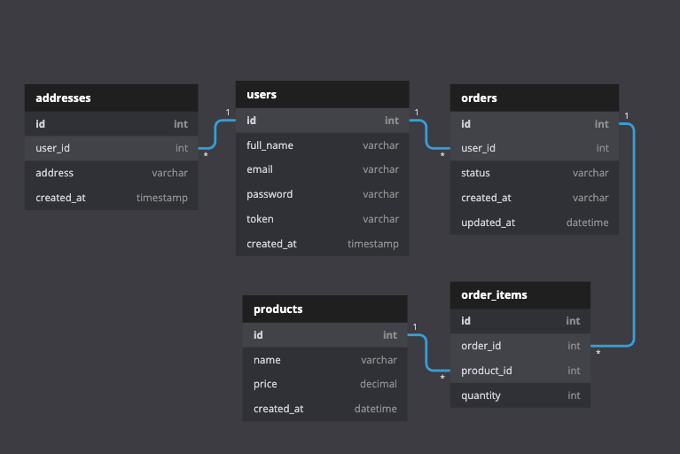

# Api for the study of automated tests, test coverage

## S.O.L.I.D.

### Single responsability principle
Files/Class/functions must have only one responsability, one task. Avoid "super methods". 
A class should have one, and only one, reason to change.

### Open closed principle
Class should be opened for extensions but not open for modifications. 
You should be able to extend a classes behavior, without modifying it.

### Liskiv substitution principle
Principle argues that you can replace implementations that a class depends on, without damaging the rest.
Derived classes must be substitutable for their base classes.

### Interface Segregation Principle
Avoid creating very robust interfaces, segregating them into smaller chunks that make sense.
Make fine grained interfaces that are client specific.

### Dependency Inversion Principle
Classes that perform actions must not depends on implementations but must depends of interfaces. Depend on abstractions, not on concretions.

## Model to be developed

